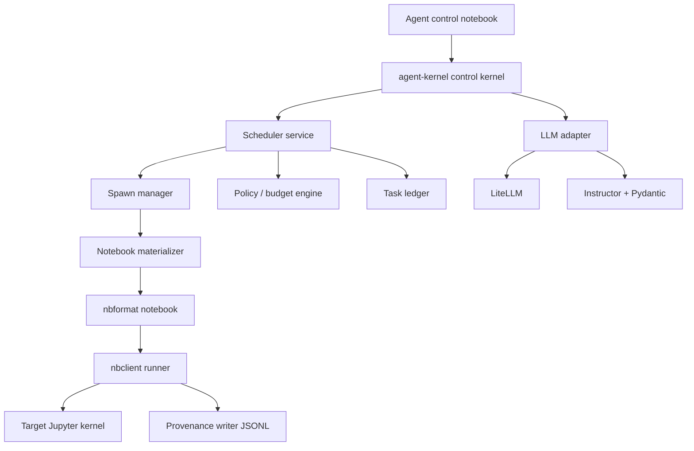
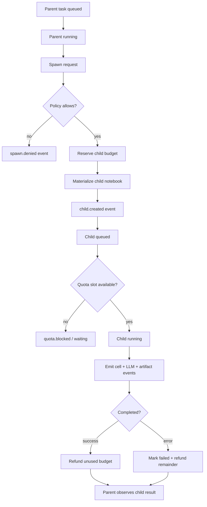

# Python-first implementation specification for wiki3-ai/agent-kernel

## Executive summary

The right starting point for `wiki3-ai/agent-kernel` is **not** to extend urlwiki3-ai/ai-sdk-chat-kernelhttps://github.com/wiki3-ai/ai-sdk-chat-kernel as the main substrate. That repository is explicitly positioned as a **JupyterLite** chat kernel and is overwhelmingly TypeScript-based, while urlwiki3-ai/agent-client-kernelhttps://github.com/wiki3-ai/agent-client-kernel is already a Python, entity["software","MetaKernel","Jupyter kernel template library"], JupyterLab-compatible kernel and is therefore the closer implementation precedent for a Python-first server-side kernel. The design lesson to keep from urlwiki3-ai/verified-agenthttps://github.com/wiki3-ai/verified-agent is the **separation of a small policy core from operational adapters**, not the PoC’s exact shape. citeturn11view0turn9view0turn13view0

The minimal working architecture is a **three-part system**: a control kernel for authoring and orchestration, a server-side extension/service for scheduling and persistence, and a notebook runner built on entity["software","nbclient","Jupyter notebook execution library"]. This aligns well with how entity["software","JupyterLab","web-based interactive development environment"] and entity["software","Jupyter Server","server application for Jupyter"] model notebook sessions, kernels, and kernel lifecycle. citeturn19view5turn35view0turn32view0

For execution, `agent-kernel` should use `nbformat` + `nbclient` as the durable core. `nbformat` gives stable notebook read/write and unique cell IDs; `nbclient` gives whole-notebook execution, per-cell hooks, timing capture, and explicit control over timeouts and kernel startup. citeturn19view7turn29view0turn19view0turn28view0

For LLM integration, the strongest Python-first stack is **entity["software","LiteLLM","Python LLM gateway library"] + entity["software","Instructor","structured output library for LLMs"] + entity["software","Pydantic","Python data validation library"]**: LiteLLM standardizes multi-provider calls into an OpenAI-shaped interface and provides exception normalization and fallbacks; Instructor turns schema-first output generation into a simple `response_model=` workflow with retries; Pydantic gives strict validation, JSON Schema, and settings/config modeling. citeturn19view1turn22search2turn22search3turn21view0turn19view3turn20view0turn20view1

The persistence recommendation for the MVP is **append-only JSONL for provenance + small task state files + optional SQLite index later**. JSON Lines is well-suited to append-only logs and cooperative process messaging; SQLite is valuable once indexed queries and transactional updates become necessary, and Jupyter Server itself already uses SQLite-backed session storage internally. citeturn16search0turn16search2turn16search6turn32view0turn19view8

The MVP should **not require any frontend work**. The first release should be installable into JupyterLab with a kernelspec, a server extension, a Python API, and a small set of magics. Frontend affordances can come later once the server-side task model, spawn lineage, provenance, and policy enforcement are stable. citeturn19view5turn9view0

## Recommended architecture

The recommended architecture is a **Python monorepo with two installable runtime surfaces**: a control kernel package and a server extension/service package. The control kernel provides notebook-native authoring, magics, and orchestration UX. The server extension provides a scheduler, task registry, provenance emission, and future REST hooks for JupyterLab UI integration. Child notebooks are executed by ordinary kernels through `nbclient`; this is what preserves the user’s requirement that the system can run notebooks for **any installed Jupyter kernel** without turning notebooks themselves into MCP tools. citeturn30view0turn19view5turn32view0

This maps naturally onto how Jupyter separates concerns. In the Jupyter stack, a **session is a mapping from notebook path to kernel**, and JupyterLab reconnects to the same session on browser refresh by looking up the session for that path. On the server side, Session Manager coordinates with Contents Manager, Mapping Kernel Manager, and the provisioner layer to create and delete sessions and kernels. That lifecycle is the correct substrate for notebook-backed tasks and spawned subtasks. citeturn35view0turn32view0

The control kernel may be implemented either as a direct `ipykernel.kernelbase.Kernel` subclass or on top of entity["software","MetaKernel","Jupyter kernel template library"]. For this project, I recommend **MetaKernel for the control kernel only**, because it already provides magics and kernel scaffolding and is the basis of `agent-client-kernel`. The notebook runner, scheduler, policy engine, and provenance writer should remain plain Python services, not MetaKernel abstractions. That preserves a small operable core while minimizing custom protocol work. citeturn30view0turn25view2turn9view0



The architecture above is also consistent with the direction of `verified-agent`: keep the decision logic small, typed, and testable, and push world-facing effects into adapters. In your case the “decision logic” is not ACL2-first, but the same discipline applies: the scheduler and policy engine should be **pure-Python functions over typed task state**, while notebook execution, provider calls, file writes, and Jupyter integration stay in adapters. citeturn13view0

### Kernel integration approaches

The table below synthesizes the most realistic kernel integration options for this project from the Jupyter kernel authoring docs, the Jupyter Server extension model, and MetaKernel’s feature set. citeturn30view0turn19view5turn25view2

| Approach | Advantages | Drawbacks | Recommendation |
|---|---|---|---|
| Direct `ipykernel.kernelbase.Kernel` subclass | Smallest dependency surface; total control over `do_execute`, completion, inspect, shutdown | You must implement more of the UX yourself | Good long-term if you want maximal control |
| MetaKernel-based control kernel | Fastest path to working magics, completions, shell/file magics, and notebook-native UX | Extra dependency; not needed for runner/scheduler core | **Best MVP choice** |
| Server extension only | Excellent for handlers, authz, background tasks, and persistence | Not a kernel; cannot itself be selected as notebook kernel | Necessary companion, not sufficient alone |
| Pure library with no kernel | Reusable internals and easiest testing story | Poor notebook UX; no kernel-native orchestration surface | Necessary internal layer, not the product surface |

## Repository and package specification

The repository should be a Python monorepo named `wiki3-ai/agent-kernel`, with one `pyproject.toml`, one shared type/model layer, and two runtime entry points: `agent_kernel` for the control kernel and `agent_kernel_server` for the extension/service. This layout fits both the Python packaging patterns already visible in `agent-client-kernel` and the Jupyter Server `ExtensionApp` model. citeturn9view0turn19view5turn18search1

```text
agent-kernel/
├── pyproject.toml
├── README.md
├── LICENSE
├── .github/
│   ├── workflows/
│   │   ├── ci.yml
│   │   ├── integration.yml
│   │   └── release.yml
│   └── ISSUE_TEMPLATE/
├── docs/
│   ├── architecture.md
│   ├── schemas/
│   │   ├── provenance-event.schema.json
│   │   ├── task.schema.json
│   │   └── executable-cell-artifact.schema.json
│   └── examples/
├── agent_kernel/
│   ├── __init__.py
│   ├── kernel.py
│   ├── magics.py
│   ├── install.py
│   ├── config.py
│   ├── api.py
│   ├── models/
│   │   ├── task.py
│   │   ├── policy.py
│   │   ├── event.py
│   │   ├── artifact.py
│   │   └── ledger.py
│   ├── runtime/
│   │   ├── scheduler.py
│   │   ├── spawn_manager.py
│   │   ├── notebook_runner.py
│   │   ├── template_registry.py
│   │   ├── parameter_injection.py
│   │   └── provenance.py
│   ├── llm/
│   │   ├── adapter.py
│   │   ├── routing.py
│   │   ├── schemas.py
│   │   └── prompts.py
│   ├── storage/
│   │   ├── filesystem.py
│   │   ├── jsonl_store.py
│   │   ├── state_store.py
│   │   └── sqlite_index.py
│   └── kernelspec/
│       └── kernel.json
├── agent_kernel_server/
│   ├── __init__.py
│   ├── app.py
│   ├── handlers.py
│   ├── authz.py
│   ├── events.py
│   └── service.py
├── tests/
│   ├── unit/
│   ├── integration/
│   ├── differential/
│   └── fixtures/
└── CODING_AGENT.md
```

### Key modules and their responsibilities

`agent_kernel.kernel` should define the control kernel class and dispatch notebook cells either as natural-language task directives or explicit magic commands. If you choose MetaKernel for the control kernel, this module should be thin: command parsing, state lookup, task submission, and human-readable result rendering. If you later move to a direct kernel subclass, the same public API can be preserved because the scheduler and runner live outside the kernel. citeturn25view2turn30view0

`agent_kernel.runtime.notebook_runner` is the most important operational module. It should use `nbformat.read(..., as_version=4)` and `nbformat.write(...)`, preserve cell IDs, and execute notebooks with `nbclient.NotebookClient`. The runner should attach `on_notebook_start`, `on_cell_start`, `on_cell_execute`, `on_cell_complete`, `on_cell_error`, and `on_notebook_complete` hooks so that provenance is captured at notebook and cell granularity. It should also rely on `record_timing`, `timeout`, `timeout_func`, `startup_timeout`, and `cwd` control from `nbclient`. citeturn19view7turn29view0turn19view0turn28view0

`agent_kernel_server.app` should subclass Jupyter Server’s `ExtensionApp`. Use `initialize_settings()` to register service objects, `initialize_handlers()` to add REST endpoints, and `_start_jupyter_server_extension()` to start background tasks such as the task scheduler loop, reaper, and event fanout. This is the canonical server-side way to attach durable background behavior to the Jupyter process. citeturn18search0turn19view5turn18search1

### Core public Python API

The minimal Python API should be intentionally small and typed:

```python
from pathlib import Path
from agent_kernel.api import (
    TaskSpec,
    SpawnSpec,
    PolicyProfile,
    create_task,
    spawn_child_task,
    run_task,
    get_task,
    list_events,
)

task = create_task(
    TaskSpec(
        notebook=Path("tasks/parent.ipynb"),
        policy_profile="local-dev",
        kernel_name="python3",
    )
)

child = spawn_child_task(
    task.id,
    SpawnSpec(
        template_name="python-analysis",
        parameters={"query": "top anomalies", "limit": 20},
        kernel_name="python3",
    ),
)

result = run_task(child.id)
events = list_events(child.id)
```

That surface should map one-to-one to the internal services so contributor work stays localized. The implementation underneath should be Pydantic-modeled and filesystem-backed in the MVP. This preserves the “parameterized like MCPs” design goal without turning notebooks themselves into MCP servers. citeturn19view3turn20view0turn17search0turn17search2

## Notebook execution, sessions, and spawn lifecycle

The core task abstraction should be: **a task is a notebook descriptor plus policy state plus lineage**. A task may point at an existing notebook or materialize a new notebook from a template. A spawned child task always receives a reservation from its parent’s remaining budget and lineage metadata linking `parent_task_id`, `spawn_index`, and `decision_event_id`. That fits your requirement that the task item is a notebook and that subtasks are notebook spawns provisioned from the parent’s budget.

### Why nbclient is the right execution core

`nbclient` is the best execution core because it already does the thing you need most: execute a notebook document, update outputs in-place, and expose granular hook points before and after notebook and cell execution. It also records execution timing, manages kernel lifecycle through a kernel manager/client, and surfaces explicit timeout and error semantics. citeturn19view0turn28view0

entity["software","Papermill","parameterized notebook execution tool"] remains useful, but specifically for its parameterization vocabulary rather than as the runtime center of gravity. Its docs make clear that it injects an `injected-parameters` cell after a `parameters`-tagged cell. That is an excellent behavior to emulate, but `agent-kernel` should own the materialization step itself so parameter injection, provenance metadata, and budget lineage are all first-class. citeturn25view1

### Execution library choice

The table below compares the realistic notebook-execution options for the MVP. Source capabilities are from the official `nbclient`, `papermill`, and Jupyter client/kernel docs; the recommendation is synthesis. citeturn19view0turn28view0turn25view1turn30view0

| Option | Strengths | Weaknesses | Recommendation |
|---|---|---|---|
| `nbclient` | Direct notebook execution, hooks, timing, timeout control, standard Jupyter kernel path | No opinionated parameterization UX by itself | **Primary runtime** |
| `papermill` | Familiar parameterization semantics, notebook templating vocabulary | Extra layer if you already need custom provenance and spawn semantics | Optional compatibility layer |
| Low-level `jupyter_client` only | Maximum protocol control | Re-implements notebook traversal, output handling, and timing logic | Use only below `nbclient` when necessary |

### Session and kernel integration

JupyterLab’s services model treats a **session as a durable path-to-kernel mapping**, and explicitly uses that to reconnect a notebook client to the same kernel after refresh. On the server side, the session workflow goes through Session Manager, Contents Manager, Mapping Kernel Manager, and the provisioner layer, and Jupyter Server persists session data in SQLite by default. This means `agent-kernel` should treat the notebook path as the durable task anchor and should not invent a competing path abstraction. citeturn35view0turn32view0

For spawned notebooks, the recommended lifecycle is:

1. Materialize a notebook file with `nbformat`.
2. Ensure `metadata.kernelspec` and `metadata.language_info` are valid for the target kernel.
3. Register the task in the ledger before execution.
4. Submit the notebook to the scheduler.
5. Execute through `nbclient`.
6. Save the executed notebook to a run artifact path.
7. Optionally, attach or emit Jupyter Server events through the extension event surface. citeturn19view7turn29view0turn19view5turn34search1turn34search5

### Per-kernel parameter injection

A fully generic source-level parameter injector for every kernel language is not realistic at MVP scope. The correct design is a **two-channel injection model**:

- **Universal metadata channel**: store parameters in notebook metadata under `metadata.agent_kernel.inputs`.
- **Executable binding channel**: if a kernel-specific injector exists, generate an executable “injected parameters” code cell for that language.

This yields the right minimum guarantee: **any Jupyter kernel can run the notebook**, while only supported kernels get automatic variable binding. It also makes the migration path to additional kernels incremental rather than all-or-nothing.

Recommended injector registry:

- `PythonInjector`
- `ACL2Injector`
- `MetadataOnlyInjector` fallback

That mirrors the way Papermill parameterization is conceptually translator-specific while remaining notebook-native. citeturn25view1turn30view0

### Sample notebook metadata and injected cell shape

The notebook format supports notebook metadata, code-cell outputs, execution counts, and unique cell IDs, which makes it a solid place to anchor task and provenance references. citeturn29view0turn19view7

```json
{
  "metadata": {
    "kernelspec": {
      "name": "python3",
      "display_name": "Python 3"
    },
    "agent_kernel": {
      "task_id": "task_01JXYZ...",
      "parent_task_id": "task_01JABC...",
      "template_name": "python-analysis",
      "inputs": {
        "query": "top anomalies",
        "limit": 20
      },
      "policy_profile": "local-dev",
      "spawn": {
        "depth": 1,
        "spawn_index": 2,
        "budget_reservation": {
          "wall_ms": 300000,
          "llm_usd_micro": 250000
        }
      }
    }
  },
  "cells": [
    {
      "id": "params_01",
      "cell_type": "code",
      "metadata": {
        "tags": ["injected-parameters", "agent-kernel"]
      },
      "source": [
        "query = 'top anomalies'\n",
        "limit = 20\n"
      ],
      "execution_count": null,
      "outputs": []
    }
  ],
  "nbformat": 4,
  "nbformat_minor": 5
}
```

### Parent-child lifecycle



## Ledger, provenance, budgets, and artifact IR

The ledger should be modeled as **append-only provenance plus current-state snapshots**. That is the minimum core that keeps the system inspectable, replayable, and compatible with later RL-style credit assignment over the ReAct process. JSONL is the right append format for this because it is explicitly designed for one-record-at-a-time processing and log-style pipelines. citeturn16search0

### Typed task model

Use Pydantic models with strict config and `extra="forbid"` for the durable state layer. That gives you schema validation, inherited model config, strict mode where needed, and JSON Schema emission for docs and testing. citeturn19view3turn20view0

```python
from __future__ import annotations
from enum import Enum
from pydantic import BaseModel, ConfigDict, Field
from typing import Any, Literal

class TaskStatus(str, Enum):
    draft = "draft"
    queued = "queued"
    running = "running"
    completed = "completed"
    failed = "failed"
    cancelled = "cancelled"

class Budget(BaseModel):
    model_config = ConfigDict(extra="forbid", strict=True)
    wall_ms: int = 0
    cpu_ms: int = 0
    llm_usd_micro: int = 0
    llm_input_tokens: int = 0
    llm_output_tokens: int = 0
    spawn_count: int = 0

class TaskSpec(BaseModel):
    model_config = ConfigDict(extra="forbid")
    task_id: str
    notebook_path: str
    kernel_name: str
    template_name: str | None = None
    parent_task_id: str | None = None
    depth: int = 0
    status: TaskStatus = TaskStatus.draft
    reserved_budget: Budget = Field(default_factory=Budget)
    spent_budget: Budget = Field(default_factory=Budget)
    parameters: dict[str, Any] = Field(default_factory=dict)
    tags: list[str] = Field(default_factory=list)
```

### Provenance event schema

The event layer should be append-only JSONL with one event per line. Every event should include enough information to answer four questions later:

- what decision happened
- in which notebook/cell/kernel context
- against which budget/quota snapshot
- what downstream artifacts and rewards should be attributed to it

Recommended common fields:

| Field | Meaning |
|---|---|
| `event_id` | Stable unique ID |
| `ts` | RFC 3339 timestamp |
| `event_type` | Enum-like string |
| `task_id` | Owning task |
| `run_id` | Execution run instance |
| `parent_task_id` | Lineage |
| `notebook_path` | Notebook identity |
| `kernel_name` | Target kernel |
| `session_id` | Jupyter session if available |
| `cell_id` | Notebook cell identity |
| `decision_id` | ReAct decision node |
| `budget_before` / `budget_after` | Charge/refund accounting |
| `quota_snapshot` | Concurrent slot state |
| `payload` | Event-specific details |
| `artifact_ids` | Downstream artifacts |
| `status` | `ok/error/denied/cancelled` |
| `error` | Structured error object, if any |

Recommended event types:

| Event type | Required payload highlights |
|---|---|
| `task.created` | task spec, source notebook/template |
| `task.admitted` | policy profile, queue assignment |
| `task.spawn.requested` | requested template/kernel/params |
| `task.spawned` | child task id, reserved budget |
| `notebook.materialized` | path, template checksum |
| `notebook.execution.started` | kernel, cwd, timeout profile |
| `cell.execution.started` | cell id, cell hash |
| `cell.execution.completed` | duration, outputs summary |
| `cell.execution.error` | error name, traceback ref |
| `llm.call.started` | provider route, schema name |
| `llm.call.completed` | usage, retries, finish reason |
| `artifact.emitted` | artifact type/id/ref |
| `budget.debited` | metric deltas, reason |
| `budget.refunded` | metric deltas, reason |
| `quota.blocked` | blocked resource, wait reason |
| `task.completed` | summary metrics, rewards candidates |
| `task.failed` | failure category, terminal event |
| `task.cancelled` | cancellation source |

A future-compatible option is to expose these through Jupyter Server’s event surface as well as JSONL files. Jupyter Server already ships an events service and emits events from services such as contents; `agent-kernel` can mirror that pattern without depending on it for core durability. citeturn34search1turn34search5

### Sample JSONL provenance record

```json
{
  "event_id": "evt_01JXYZ0B0M3K3SN8X8Q4",
  "ts": "2026-05-10T16:24:11.502Z",
  "event_type": "llm.call.completed",
  "task_id": "task_01JXYZ0A3PAYJ5K8TJ5W",
  "run_id": "run_01JXYZ0B08M4F4X7N6JT",
  "parent_task_id": "task_01JABCD...",
  "notebook_path": "tasks/spawns/child-0002.ipynb",
  "kernel_name": "python3",
  "cell_id": "planner_01",
  "decision_id": "dec_0007",
  "budget_before": {
    "llm_usd_micro": 190000,
    "llm_input_tokens": 12500,
    "llm_output_tokens": 1800
  },
  "budget_after": {
    "llm_usd_micro": 176400,
    "llm_input_tokens": 12920,
    "llm_output_tokens": 2012
  },
  "quota_snapshot": {
    "kernel_slots_used": 2,
    "kernel_slots_total": 4
  },
  "payload": {
    "provider": "openai/gpt-4o-mini",
    "schema": "PlanStep",
    "retries": 1,
    "finish_reason": "stop"
  },
  "artifact_ids": ["art_01JXYZ0B0CFG"],
  "status": "ok"
}
```

### Executable cell artifact IR

The key durable artifact should be an **Executable Cell Artifact**: the smallest portable unit of “autoformalized into executable code” work. It should represent not only the source code but the notebook context, execution contract, and provenance anchors.

```python
from pydantic import BaseModel, ConfigDict, Field
from typing import Any, Literal

class ExecutableCellArtifact(BaseModel):
    model_config = ConfigDict(extra="forbid")
    artifact_id: str
    task_id: str
    notebook_path: str
    cell_id: str
    kernel_name: str
    language: str
    source: str
    normalized_source: str
    formalization_level: Literal["free_text", "executable", "checkable", "certified"]
    input_bindings: dict[str, Any] = Field(default_factory=dict)
    output_contract: dict[str, Any] = Field(default_factory=dict)
    side_effects: list[str] = Field(default_factory=list)
    semantic_refs: list[str] = Field(default_factory=list)   # KG / RDF / IRI refs
    provenance_event_ids: list[str] = Field(default_factory=list)
    content_hash: str
```

This artifact is the bridge between notebook execution, KG linkage, and later reward assignment. It is also the right place to store `semantic_refs` or KG IRIs while keeping KG construction physically separate, as you requested.

### Storage layout

The storage layout should be simple, explicit, and local-first:

```text
<workspace>/
├── notebooks/
│   ├── parent.ipynb
│   └── spawns/
│       ├── child-0001.ipynb
│       └── child-0002.ipynb
└── .agent_kernel/
    ├── config.json
    ├── tasks/
    │   ├── task_01J....json
    │   └── task_01K....json
    ├── runs/
    │   └── run_01J.../
    │       ├── executed.ipynb
    │       ├── stdout.log
    │       ├── stderr.log
    │       └── outputs/
    ├── events/
    │   ├── 2026-05-10.jsonl
    │   └── 2026-05-11.jsonl
    ├── artifacts/
    │   ├── art_01J....json
    │   └── by-task/
    └── indexes/
        └── state.sqlite
```

This layout intentionally keeps the **source notebook visible** and the operational state hidden under `.agent_kernel/`. It also works with Jupyter’s filesystem-oriented Contents Manager model and later allows pre-save/post-save hooks if you want notebook writes to trigger summaries or sidecar updates. citeturn31search0turn31search1turn8search4

### Storage option comparison

The comparison below uses JSON Lines and SQLite primary docs plus Jupyter Server’s own SQLite-backed session storage as reference points. citeturn16search0turn19view8turn16search2turn16search6turn32view0

| Option | Strengths | Weaknesses | Recommendation |
|---|---|---|---|
| Filesystem JSONL + JSON state files | Easy diffs, append-friendly, inspectable, excellent for provenance | Slower for rich queries and cross-task joins | **Best MVP default** |
| SQLite-only | Atomic updates, better indexed queries, mature standard library path | Harder to diff/review manually; more migration friction to browser-only targets | Add only after query pressure becomes real |
| Hybrid JSONL + SQLite index | Best observability + best query path | More code and consistency management | Best post-MVP evolution |

### Budget and quota policy semantics

Policy should be parameterized and modeled separately from task state. The easiest way to make this feel “MCP-like” without over-abstracting is to define **named policy profiles** with explicit semantics:

- **Budget**: consumable numeric allowances, e.g. wall-clock, CPU, LLM spend, input tokens, output tokens, bytes written, spawn count.
- **Quota**: concurrency ceilings, e.g. max live child tasks, max running notebooks, max running kernels, max pending starts.
- **Reservation**: amount carved out of a parent at spawn time.
- **Refund**: unused reserved budget returned when child terminates.
- **Inheritance**: child receives a snapshot of profile settings plus parameter overrides.
- **Escalation**: tasks may request more budget, but parent or operator approval policy decides.

Example semantics:

- A parent may not reserve more than `available - reserve_floor`.
- A child may not itself spawn if `depth == max_spawn_depth`.
- Kernel slots are acquired when execution is admitted, not when requested.
- LLM budget is debited on completion events, not request start, to use actual token/cost data.
- If a task fails before spending its reservation, the unspent amount is refunded.
- If quota blocks admission, the task remains queued and emits `quota.blocked`.

Example parameterized profile:

```json
{
  "name": "local-dev",
  "max_spawn_depth": 3,
  "max_children_per_task": 6,
  "kernel_slots_total": 4,
  "queue_limit": 64,
  "reservation_policy": {
    "spawn_wall_ms_default": 300000,
    "spawn_llm_usd_micro_default": 250000,
    "parent_reserve_floor_ratio": 0.15
  },
  "budgets": {
    "wall_ms": 1800000,
    "cpu_ms": 600000,
    "llm_usd_micro": 2000000,
    "llm_input_tokens": 250000,
    "llm_output_tokens": 100000,
    "spawn_count": 12
  },
  "permissions": {
    "allow_network": true,
    "allow_write": "workspace",
    "allow_shell": false
  }
}
```

## LLM adapter and API surface

The strongest Python-first LLM adapter design is:

- **LiteLLM** for provider normalization and routing
- **Instructor** for schema-first structured generation
- **Pydantic** for all request/response/config/event models

That division of roles matches the strengths of the three libraries as documented by their primary docs. LiteLLM exposes a unified OpenAI-style interface over 100+ models and also documents fallbacks, streaming, budget controls, and exception normalization. Instructor gives a provider-agnostic `response_model=` workflow with retries and nested typed outputs. Pydantic provides strict validation, JSON Schema emission, and settings/config classes. citeturn19view1turn22search1turn22search2turn22search3turn22search5turn21view0turn19view2turn19view3turn20view0turn20view1

### Recommended adapter layering

```python
# agent_kernel/llm/adapter.py
from typing import TypeVar, Type
from pydantic import BaseModel
import instructor

T = TypeVar("T", bound=BaseModel)

class StructuredLLM:
    def __init__(self, provider_model: str, api_key: str | None = None):
        self.client = instructor.from_provider(provider_model, api_key=api_key)

    def generate(self, schema: Type[T], messages: list[dict], max_retries: int = 2) -> T:
        return self.client.chat.completions.create(
            response_model=schema,
            messages=messages,
            max_retries=max_retries,
        )
```

The important design rule is: **schemas are yours, provider knobs are adapters, and ledger accounting stays outside the provider library**. LiteLLM’s own budget features are useful as a second safety layer, but the source of truth for task budgets should remain `agent-kernel`’s ledger so notebook execution, LLM usage, and spawn costs live in one accounting model. citeturn22search5turn21view0

### LLM library comparison

The table below uses the official LiteLLM docs, Instructor repo/docs, the official OpenAI Python SDK repo, and the official AI SDK docs as the basis for comparison. citeturn19view1turn21view0turn23search0turn35view1

| Option | Fit for Python-first JupyterLab kernel | Notes | Recommendation |
|---|---|---|---|
| LiteLLM alone | Good provider abstraction | You still own schema validation/retries ergonomics | Use underneath structured layer |
| Instructor alone | Great structured output UX | Best when paired with a provider abstraction | Use above LiteLLM-shaped provider choice |
| LiteLLM + Instructor + Pydantic | Excellent | Cleanest Python-first structured runtime | **Recommended** |
| Official OpenAI Python SDK only | Strong if you want one provider and provider-native APIs | Not multi-provider by design | Fine for narrow deployments, not this project |
| urlAI SDK docsturn35view1 | Excellent for TypeScript/browser/full-stack apps | Explicitly TypeScript-first | Reuse ideas later for JupyterLite/WASM, not MVP core |

### CLI, magics, and notebook UX

The control kernel should expose a **small, composable command surface**. Borrow the ergonomics of `%agent` from `agent-client-kernel`, but keep the subcommands aligned to notebook-task orchestration rather than external ACP agents. citeturn9view0

Recommended magics:

- `%agent task new [PATH]`
- `%agent task open`
- `%agent task status [TASK_ID]`
- `%agent run [TASK_ID]`
- `%agent spawn TEMPLATE [--kernel K] [--param k=v]...`
- `%agent policy show [PROFILE]`
- `%agent policy use PROFILE`
- `%agent quota`
- `%agent ledger tail [N]`
- `%agent llm route [MODEL]`
- `%agent artifacts list [TASK_ID]`

Recommended CLI:

```bash
python -m agent_kernel install --user
jupyter server extension enable agent_kernel_server
agent-kernel scaffold --template python-analysis tasks/parent.ipynb
agent-kernel run tasks/parent.ipynb --policy local-dev
agent-kernel inspect task_01JXYZ...
```

The control kernel should also support plain-cell directives for a notebook-native workflow, but the implementation should **compile those directives into the same TaskSpec/SpawnSpec API** used by the Python API and CLI. That keeps behavior consistent and testable.

## Security, testing, roadmap, and contributor guide

### Security and sandboxing

Jupyter Server’s own docs are blunt: access to the server means access to running arbitrary code, and token auth is enabled by default. The server also has an explicit separation between authentication and authorization via `IdentityProvider` and `Authorizer`. `agent-kernel` should therefore assume that security must exist at **both** the Jupyter boundary and the task-policy boundary. citeturn26view0turn31search8

Minimum MVP security posture:

- require normal Jupyter auth; do not weaken token/password defaults
- wrap server-extension handlers with authenticated/authorized checks
- keep API keys in environment or server-side secret sources, never notebook metadata
- redact secrets from JSONL provenance
- default child notebook execution to non-interactive mode
- default shell/network/file-write permissions to policy-controlled allowlists
- store provenance under workspace-local directories, not global temp dirs

For runtime isolation beyond the local process, Jupyter Client’s provisioner model is the correct next step. Kernel provisioners were introduced specifically to let third parties manage kernel runtime environments across local and resource-managed contexts, with `LocalProvisioner` as the default when no custom provisioner is declared. That makes provisioners the right future bridge to container, Slurm, or edge-node isolation. citeturn26view2

### Differential testing against the ACL2 specification

`verified-agent` already names the kinds of invariants you care about: permissions safety, budget non-negativity, termination bounds, and state-transition preservation. Even if `agent-kernel` is not a direct port, the **policy engine should mirror those decisions** closely enough for differential tests. citeturn13view0

Recommended test strategy:

- **Unit tests**
  - policy arithmetic
  - spawn reservation/refund logic
  - event serialization
  - storage atomicity under crashes
  - parameter injection by kernel type

- **Integration tests**
  - materialize → execute → persist child notebook
  - quota blocking with concurrent tasks
  - Jupyter Server extension startup and handler auth
  - JupyterLab-visible kernelspec installation
  - real `nbclient` execution over fixture notebooks

- **Differential tests vs ACL2-inspired policy vectors**
  - export golden decision vectors from ACL2 or hand-built fixtures modeled on the verified properties
  - assert Python policy engine agrees on:
    - `can_spawn`
    - `must_stop`
    - budget never negative after debit/refund
    - remaining steps strictly decrease or task terminates
  - add property-based tests over random inputs to ensure monotonic invariants

- **Regression tests**
  - replay JSONL event streams into state reconstruction
  - reproduce past failure traces from fixture logs
  - compare normalized executable-cell artifacts before/after refactors

### MVP roadmap

The minimal roadmap should be:

| Milestone | Deliverable |
|---|---|
| Foundation | repo, packaging, kernelspec install, `ExtensionApp`, typed models |
| Control kernel | `%agent` magics, task creation, task inspection |
| Notebook runtime | materializer, parameter injection, `nbclient` execution, executed notebook artifact |
| Ledger core | JSONL provenance, task snapshots, artifact IR |
| Scheduler | queueing, quotas, budget reservation/refund, lineage |
| LLM adapter | LiteLLM + Instructor + Pydantic schemas |
| Hardening | integration tests, ACL2 differential tests, authz/security defaults |
| Migration prep | storage/runner interfaces ready for browser/WASM adapters |

### Migration path to JupyterLite and WASM

The migration path should preserve **models and policies**, not runtime assumptions. The server-side MVP targets JupyterLab and Jupyter Server first because that is the simplest environment for durable storage, process spawning, and multi-kernel execution. But the long-term browser/WASM path becomes much easier if the codebase is split into:

- `agent_kernel.models` — pure typed schemas
- `agent_kernel.policy` — pure budget/quota/lineage logic
- `agent_kernel.storage` — pluggable backends
- `agent_kernel.runtime` — server-side runner/scheduler
- `agent_kernel_browser` later — browser storage + browser execution + local model bridges

This is also where lessons from urlwiki3-ai/ai-sdk-chat-kernelhttps://github.com/wiki3-ai/ai-sdk-chat-kernel and the urlAI SDK docsturn35view1 become useful: that codebase already demonstrates browser-local provider selection, browser key entry, and local/cloud model fallback logic, but it is a **future sibling runtime**, not the foundation of the current Python-first server-side kernel. citeturn11view0turn14search0turn35view1

`marimo` is relevant inspiration here because it exposes notebook-aware AI tools and MCP access to notebook data, but its own docs also make clear that its notebook/runtime model differs from Jupyter’s and that some AI editing tools are experimental. `agent-kernel` should borrow the idea of notebook-aware tools and variable/runtime inspection, not the runtime substrate. citeturn25view3turn17search8turn17search14

### Example workflows

#### Workflow for a parent notebook spawning child notebooks

1. User opens a control notebook under the `agent-kernel` control kernel.
2. They define a task target notebook and policy profile.
3. The kernel registers the task and emits `task.created`.
4. The user or planner requests a child spawn with a template and parameters.
5. The spawn manager reserves budget from the parent.
6. The materializer creates `spawns/child-000N.ipynb`.
7. The scheduler admits the child when quota allows.
8. The runner executes it with `nbclient`.
9. Events, artifacts, and summary state are written.
10. The parent notebook fetches the child result and decides the next ReAct step.

#### Workflow for a notebook-first research run

```python
from agent_kernel.api import create_task, run_task

task = create_task(
    notebook="notebooks/research.ipynb",
    kernel_name="python3",
    policy_profile="research"
)

result = run_task(task.id)
print(result.final_status)
print(result.executed_notebook_path)
print(result.artifact_ids)
```

These flows deliberately keep the user in ordinary notebooks while giving the scheduler the data it needs for provenance and learning.

### Proposed CODING_AGENT.md

```md
# CODING_AGENT.md

## Purpose

This repository implements a Python-first JupyterLab server-side Agent Kernel named `agent-kernel`.

The first production target is:
- JupyterLab
- Jupyter Server
- filesystem-backed workspace state
- notebook execution through nbclient
- typed schemas via Pydantic
- structured LLM calls through LiteLLM + Instructor

This repo does **not** require a frontend for MVP.

## Architectural rules

1. Keep policy/budget/quota logic pure and typed.
2. Keep notebook execution in `runtime/notebook_runner.py`.
3. Never let provider-specific code leak into task models.
4. All durable data structures must be Pydantic models.
5. All provenance must be append-only JSONL.
6. Child task spawn must reserve parent budget before materialization.
7. Notebook paths are first-class identifiers; do not invent hidden surrogate path schemes.
8. Support any installed Jupyter kernel for execution; executable parameter injection is plugin-based by kernel type.

## Step-by-step contributor tasks

### Issue group: foundation

- [ ] Create `pyproject.toml` with package extras:
  - `server`
  - `llm`
  - `dev`
- [ ] Add package skeleton for:
  - `agent_kernel`
  - `agent_kernel_server`
- [ ] Add kernelspec install command
- [ ] Add Jupyter Server extension discovery hooks
- [ ] Add CI for Python 3.11 and 3.12

Tests to write:
- [ ] import smoke test
- [ ] kernelspec render test
- [ ] extension discovery test

### Issue group: typed models

- [ ] Implement models:
  - `TaskSpec`
  - `TaskStatus`
  - `Budget`
  - `QuotaSnapshot`
  - `ProvenanceEvent`
  - `ExecutableCellArtifact`
- [ ] Export JSON Schemas into `docs/schemas/`

Tests to write:
- [ ] strict validation tests
- [ ] schema snapshot tests
- [ ] backward-compatibility snapshot tests

### Issue group: storage

- [ ] Implement append-only JSONL event writer
- [ ] Implement task state store with atomic file replace
- [ ] Implement artifact store
- [ ] Add optional SQLite index layer behind feature flag

Tests to write:
- [ ] append/read roundtrip
- [ ] crash-safe write simulation
- [ ] recovery from partial JSONL line
- [ ] state reconstruction from event stream

### Issue group: notebook runtime

- [ ] Implement notebook read/write helpers with nbformat
- [ ] Implement template materializer
- [ ] Implement injector registry:
  - `PythonInjector`
  - `ACL2Injector`
  - `MetadataOnlyInjector`
- [ ] Implement `NotebookRunner` using nbclient hooks
- [ ] Save executed notebook artifact and run logs

Tests to write:
- [ ] fixture notebook executes successfully
- [ ] timeout behavior
- [ ] cell error capture
- [ ] timing metadata capture
- [ ] injected parameter cell placement
- [ ] metadata-only parameter fallback

### Issue group: scheduler and policy

- [ ] Implement queue + async scheduler
- [ ] Implement concurrency slot semaphore
- [ ] Implement budget reservation/refund
- [ ] Implement spawn depth and child count limits
- [ ] Implement cancel/fail/complete transitions
- [ ] Implement state reconstruction from events

Tests to write:
- [ ] concurrent admission respects quota
- [ ] child reservation cannot overdraw parent
- [ ] unused reservation refunded
- [ ] spawn denied at max depth
- [ ] cancellation releases slots

### Issue group: kernel UX

- [ ] Implement control kernel class
- [ ] Implement `%agent` magic parser
- [ ] Add commands:
  - `task new`
  - `task status`
  - `spawn`
  - `run`
  - `policy show`
  - `quota`
  - `ledger tail`

Tests to write:
- [ ] magic command parsing
- [ ] output formatting snapshots
- [ ] end-to-end spawn from notebook cell fixture

### Issue group: LLM adapter

- [ ] Implement LiteLLM route config model
- [ ] Implement Instructor-backed structured call wrapper
- [ ] Add usage accounting and retries metadata
- [ ] Add provider fallback policy

Tests to write:
- [ ] fake-provider structured response validation
- [ ] retry on invalid schema
- [ ] fallback path exercised
- [ ] token/cost accounting stored in provenance

### Issue group: server extension

- [ ] Add handlers:
  - `POST /api/agent-kernel/tasks`
  - `GET /api/agent-kernel/tasks/{id}`
  - `POST /api/agent-kernel/tasks/{id}/run`
  - `GET /api/agent-kernel/tasks/{id}/events`
- [ ] Add authenticated + authorized access checks
- [ ] Add background scheduler startup in extension app

Tests to write:
- [ ] handler auth tests
- [ ] task creation handler test
- [ ] run handler test
- [ ] events pagination test

### Issue group: differential verification

- [ ] Define Python policy functions mirroring ACL2-style invariants
- [ ] Add golden fixtures for:
  - permission safety
  - budget non-negativity
  - must-stop semantics
  - step-bound termination
- [ ] Add property-based tests around budget monotonicity and lineage invariants

Tests to write:
- [ ] fixture agreement tests
- [ ] Hypothesis property tests
- [ ] replay deterministic state evolution from event traces

## PR checklist

- [ ] Does this change preserve append-only provenance?
- [ ] Are all new durable structures modeled with Pydantic?
- [ ] Are notebook paths and cell IDs preserved?
- [ ] Are there unit tests?
- [ ] Are there integration tests if runtime behavior changed?
- [ ] If policy logic changed, were differential tests updated?
- [ ] Were docs/schema snapshots updated?
- [ ] Did you avoid adding frontend dependencies?
- [ ] Did you avoid leaking provider-specific data into task models?
- [ ] Did you document any migration impact?

## Non-goals for MVP

- No custom JupyterLab frontend
- No full browser/WASM execution path yet
- No DB-only storage requirement
- No MCP abstraction for notebooks themselves
```

### Open questions and limitations

A few design choices should remain explicitly open until the first implementation spike is complete:

- whether the control kernel should ship on MetaKernel first or start directly from `ipykernel.kernelbase.Kernel`
- whether the SQLite index is needed in the first release or can wait until event volumes justify it
- how much of the ACL2 differential suite can be generated automatically versus hand-curated as golden vectors
- whether large rich outputs should be fully retained in JSONL-linked artifacts or summarized with content-addressed sidecars
- which kernel-specific parameter injectors beyond Python and ACL2 are worth supporting in MVP

Those are real implementation questions, but they do not block the central recommendation: **build `wiki3-ai/agent-kernel` as a new Python-first JupyterLab/server-side repo with a control kernel, a server extension, a `nbclient` runner, JSONL provenance, and a LiteLLM/Instructor/Pydantic LLM stack.** citeturn9view0turn11view0turn19view0turn19view1turn21view0turn19view3